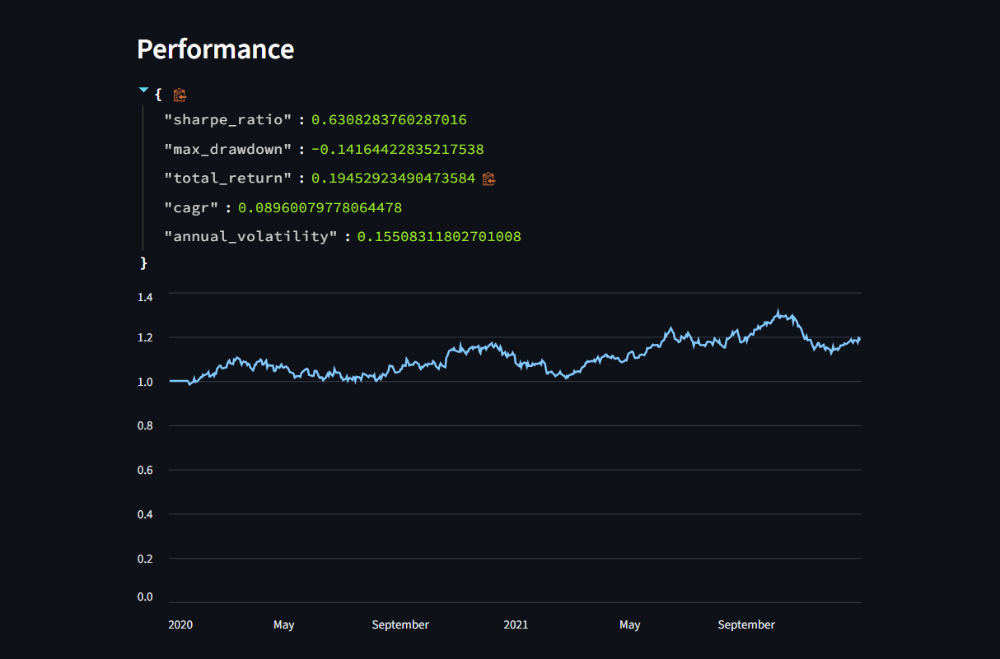
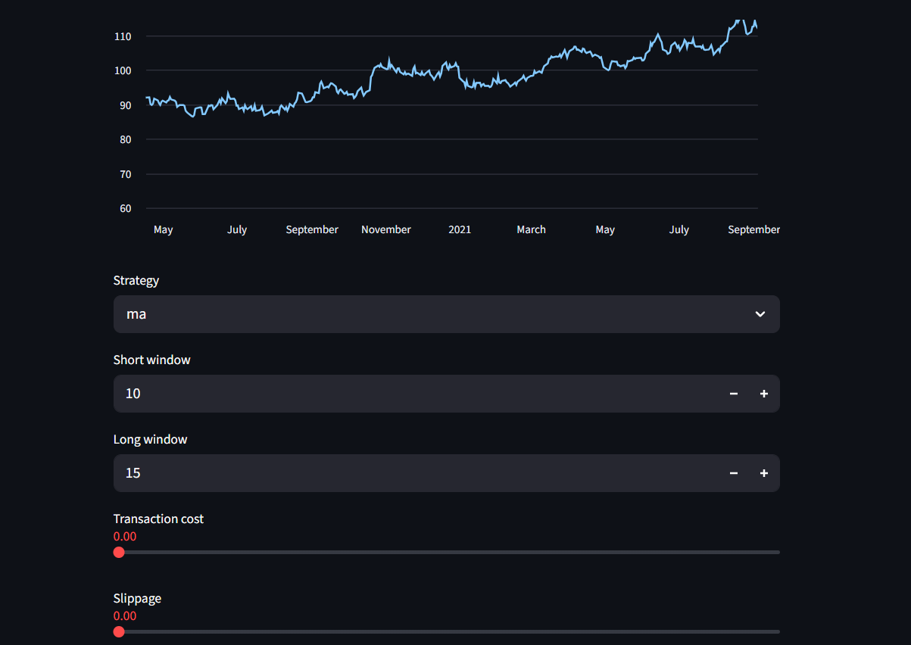

# Trading Backtester

[](https://github.com/username/trading-backtester/actions/workflows/python-package.yml)
[](LICENSE)


Modular Python backtesting engine for evaluating systematic trading strategies on historical market data, with CLI tooling, performance analytics, and a Streamlit interface.

## Structure

```
trading-backtester
│
├── data/
├── strategies/
├── backtester.py
├── metrics.py
├── main.py
├── requirements.txt
└── README.md
```

## Usage

Data must be a CSV with a datetime index in the first column and at least a
`Close` price column. Put example files under `data/` as shown.

### Running the backtester

You can either install from the requirements file or build the package locally:

```bash
pip install -r requirements.txt
# or
pip install .
```

Installing using `pip install .` will register a `backtester` console script so you can run:

```bash
backtester data/your_history.csv --strategy ma --short 20 --long 50
```

Then invoke the CLI script:

```bash
python main.py data/your_history.csv --strategy ma --short 20 --long 50
```

You can switch strategies (`ma`, `meanrev`, `rsi`) and tune parameters via
command‑line options. Transaction costs and slippage can be specified with
`--cost` and `--slippage`.

Example output:

```
$ python main.py data/sample.csv --strategy rsi --period 3 --lower 25 --upper 75
Performance:
  sharpe_ratio: 0.1234
  max_drawdown: -0.0456
  total_return: 0.0789
  cagr: 0.0678
  annual_volatility: 0.1543
```

### Strategies

- **ma**: moving average crossover
- **meanrev**: z‑score mean reversion
- **rsi**: RSI overbought/oversold

Add your own by dropping a class in `trading_backtester/strategies` with a
`generate_signals(df)` method that returns a DataFrame containing a `signal`
column.

A simple example script is provided in the `examples/` directory to show
importing the library programmatically.

## Web interface

An interactive frontend is available using Streamlit. Launch it with:

```bash
streamlit run webapp/app.py
```

You can upload a CSV, choose strategies/parameters, and immediately view
performance and equity charts. Example screenshots are shown below so an
employer can get a feel for the UI without running it:






---

## License

This project is released under the MIT License. See the `LICENSE` file for details.


## Writing Strategies

Create a new class in the `strategies/` folder with a `generate_signals(data)` method that returns a DataFrame with a `signal` column (1 for long, -1 for short, 0 for neutral).

## Metrics

- Sharpe ratio
- Max drawdown
- Total return

## Testing

The project includes basic tests powered by `pytest`. After installing requirements, run:

```bash
pytest
```

